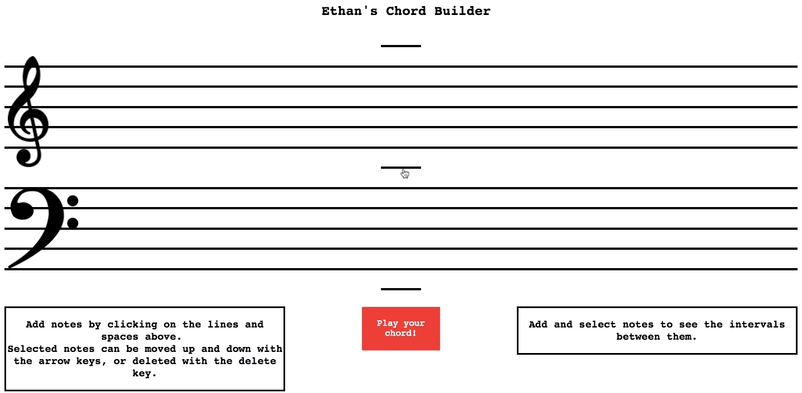
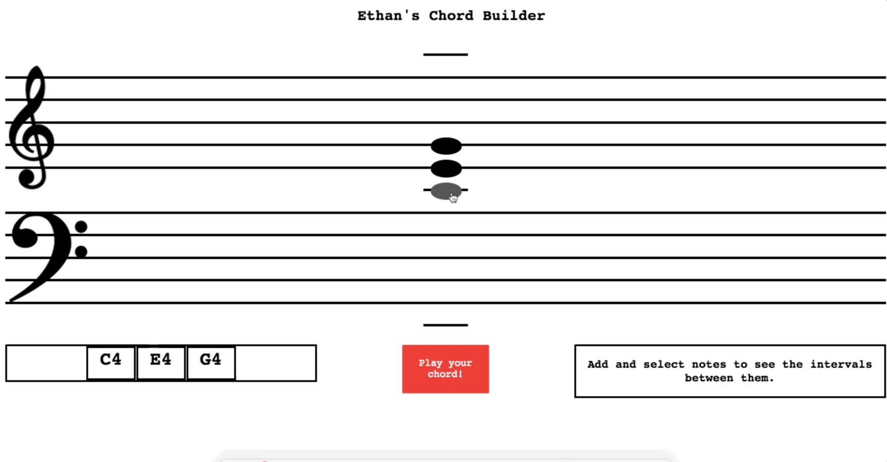

Ethan's Chord Builder
---
A simple browser-based front-end application for students of music theory, this tool allows users to add notes to a grand staff, select and move notes around, examine the relationships between notes, and listen to the chords they've created.

#### How it works
When the user clicks on a line or space, a note is appended to a corresponding div.
When notes are selected, they can be moved around using the arrow keys (since this application relies heavily on keyboard events, it can't currently be used on mobile devices).
When multiple notes are selected, you can see the intervals between the notes, and where applicable, the quality and inversion of the chord corresponding to those notes.

#### A note about styling
I challenged myself to style this app with raw CSS. The result is imperfect, but I learned a ton about CSS in the process. There are many kinks left to be worked out.

Built With
---
[React](https://github.com/facebook/react)

[jQuery](https://github.com/jquery/jquery)

[webpack](https://github.com/webpack/webpack)

[webAudioDAW](https://github.com/rserota/wad)

Setup
---
```
npm install
```
---
Compile
---
```
npm run react-dev
```
---
Start
---
```
npm run server-dev
```
---
Demo
---
See a live demo at __https://music-theory-tutor.firebaseapp.com/__
